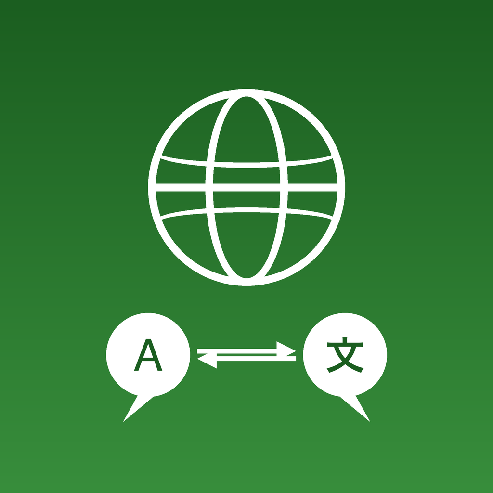

<p align="center">
  
</p>

# VoicePing iOS + Android Offline Speech Translation

[](https://github.com/voiceping-ai/ios-android-offline-speech-translation/actions/workflows/ios-build.yml)
[](https://github.com/voiceping-ai/ios-android-offline-speech-translation/actions/workflows/android-build.yml)
[](#tech-stack)
[](#tech-stack)
[](#license)

Cross-platform app for **fully offline speech-to-text transcription, text translation, and text-to-speech** — all inference runs on-device with no cloud dependency.

- **Transcription**: Multiple ASR engines (Whisper, Moonshine, SenseVoice, Zipformer, Parakeet, Apple Speech, Android SpeechRecognizer). Batch and real-time streaming modes.
- **Translation**: On-device translation (iOS: Apple Translation framework, Android: Google ML Kit / Android System Translation).
- **Text-to-Speech**: Native TTS (iOS: AVSpeechSynthesizer, Android: TextToSpeech API).
- **Audio Playback & Export**: Save session audio as WAV, play back with waveform scrubber, export as ZIP.

Models are downloaded once from HuggingFace, then all processing works completely offline. Some engines (Apple Speech, Android SpeechRecognizer) are built into the OS and require no download.

> **Related repos:**
> [iOS Transcription Only](https://github.com/voiceping-ai/ios-offline-transcribe) ·
> [Android Transcription Only](https://github.com/voiceping-ai/android-offline-transcribe)

## Features

### Both Platforms

- Real-time microphone recording with live transcript rendering
- Multiple ASR engine backends with in-app model switching
- On-device model download with progress tracking
- Streaming transcription (Zipformer transducer, endpoint-based)
- On-device translation and text-to-speech playback
- Voice Activity Detection (VAD) toggle
- Optional timestamp display
- Session audio saving as WAV (PCM 16kHz mono 16-bit)
- Audio playback with 200-bar waveform scrubber
- ZIP export of session (transcription + audio)
- Transcription history with save, copy, share, delete
- Live audio energy visualization
- CPU / memory / tokens-per-second telemetry display
- Storage guard before large model downloads

### iOS

- 5 ASR engines: WhisperKit (CoreML), sherpa-onnx offline, sherpa-onnx streaming, FluidAudio (Parakeet-TDT), Apple Speech
- 12 models across 7 families
- Apple Translation framework (iOS 18+)
- AVSpeechSynthesizer TTS
- Zero-dependency ZIP via NSFileCoordinator

### Android

- 4 ASR engines: whisper.cpp (JNI), sherpa-onnx offline, sherpa-onnx streaming, Android SpeechRecognizer
- 13 models across 5 families + system speech (offline & online)
- Google ML Kit Translation (offline, 50+ languages) or Android System Translation (API 31+)
- TextToSpeech API
- Room database with manual migration

## Supported Models

### iOS (12 models)

| Model | Engine | Size | Params | Languages |
|---|---|---:|---:|---|
| Whisper Tiny | WhisperKit (CoreML) | ~80 MB | 39M | 99 languages |
| Whisper Base | WhisperKit (CoreML) | ~150 MB | 74M | 99 languages |
| Whisper Small | WhisperKit (CoreML) | ~500 MB | 244M | 99 languages |
| Whisper Large V3 Turbo | WhisperKit (CoreML) | ~600 MB | 809M | 99 languages |
| Whisper Large V3 Turbo (Compressed) | WhisperKit (CoreML) | ~1 GB | 809M | 99 languages |
| Moonshine Tiny | sherpa-onnx | ~125 MB | 27M | English |
| Moonshine Base | sherpa-onnx | ~280 MB | 61M | English |
| SenseVoice Small | sherpa-onnx | ~240 MB | 234M | zh/en/ja/ko/yue |
| Omnilingual 300M | sherpa-onnx | ~365 MB | 300M | 1,600+ languages |
| Zipformer Streaming | sherpa-onnx | ~46 MB | 20M | English |
| Parakeet TDT 0.6B | FluidAudio (CoreML) | ~600 MB | 600M | 25 European languages |
| Apple Speech | SFSpeechRecognizer | Built-in | System | 50+ languages |

### Android (13 models)

| Model | Engine | Size | Params | Languages |
|---|---|---:|---:|---|
| Whisper Tiny | whisper.cpp | ~80 MB | 39M | 99 languages |
| Whisper Base | whisper.cpp | ~150 MB | 74M | 99 languages |
| Whisper Base (.en) | whisper.cpp | ~150 MB | 74M | English |
| Whisper Small | whisper.cpp | ~500 MB | 244M | 99 languages |
| Whisper Large V3 Turbo | whisper.cpp | ~1.6 GB | 809M | 99 languages |
| Whisper Large V3 Turbo (q8_0) | whisper.cpp | ~834 MB | 809M | 99 languages |
| Moonshine Tiny | sherpa-onnx | ~125 MB | 27M | English |
| Moonshine Base | sherpa-onnx | ~290 MB | 62M | English |
| SenseVoice Small | sherpa-onnx | ~240 MB | 234M | zh/en/ja/ko/yue |
| Omnilingual 300M | sherpa-onnx | ~365 MB | 300M | 1,600+ languages |
| Zipformer Streaming | sherpa-onnx | ~46 MB | 20M | English |
| Android Speech (Offline) | SpeechRecognizer (on-device, API 31+) | Built-in | System | System languages |
| Android Speech (Online) | SpeechRecognizer (cloud-backed) | Built-in | System | System languages |

## Architecture

### iOS

```
WhisperService (orchestrator)
 ├── ASREngine protocol
 │    ├── WhisperKitEngine
 │    ├── SherpaOnnxOfflineEngine
 │    ├── SherpaOnnxStreamingEngine
 │    ├── FluidAudioEngine
 │    └── AppleSpeechEngine
 ├── AudioRecorder (AVAudioEngine)
 ├── AppleTranslationService (iOS 18+)
 ├── NativeTTS (AVSpeechSynthesizer)
 ├── SessionFileManager + WAVWriter + ZIPExporter
 └── SystemMetrics

UI: SwiftUI (TranscriptionView, HistoryView, ModelSetupView)
Persistence: SwiftData (TranscriptionRecord)
Storage: sessions/{uuid}/audio.wav
```

### Android

```
WhisperEngine (orchestrator)
 ├── AsrEngine interface
 │    ├── WhisperCppEngine (JNI → libwhisper.so)
 │    ├── SherpaOnnxEngine (Moonshine, SenseVoice, Omnilingual)
 │    ├── SherpaOnnxStreamingEngine (Zipformer)
 │    └── AndroidSpeechEngine (SpeechRecognizer)
 ├── AudioRecorder (AudioRecord)
 ├── MlKitTranslator / AndroidSystemTranslator
 ├── AndroidTtsService (TextToSpeech API)
 ├── ModelDownloader (OkHttp)
 ├── StreamingChunkManager
 ├── WavWriter + WaveformGenerator + AudioPlaybackManager
 ├── SessionExporter (ZIP via FileProvider)
 └── SystemMetrics

UI: Jetpack Compose + Material3
Persistence: Room DB + DataStore (TranscriptionEntity)
Native: whisper.cpp (CMake → libwhisper.so + WhisperLib.kt)
Storage: sessions/{uuid}/audio.wav
```

## Translation

| | iOS | Android (default) | Android (alternative) |
|---|---|---|---|
| **Framework** | Apple Translation | Google ML Kit | Android System Translation |
| **Min OS** | iOS 18+ | API 21+ | API 31+ |
| **Languages** | System-managed | 50+ (~30 MB each) | System-managed |
| **Download** | iOS Settings > Translate | Automatic on first use | Settings > System > Languages |

## Text-to-Speech

| | iOS | Android |
|---|---|---|
| **API** | AVSpeechSynthesizer | TextToSpeech |
| **Rate** | System default | 0.25x–2.0x |
| **Behavior** | Pauses recording during playback | Falls back to en-US if locale unavailable |

## Setup

### iOS

**Requirements:** macOS, Xcode 15+, iOS 17+, XcodeGen (`brew install xcodegen`)

```bash
./scripts/generate-ios-project.sh
open VoicePingIOSAndroidOfflineSpeechTranslation.xcodeproj
```

For physical device builds:

```bash
cp project.local.yml.example project.local.yml
# Edit with your DEVELOPMENT_TEAM and PRODUCT_BUNDLE_IDENTIFIER
./scripts/generate-ios-project.sh
```

### Android

**Requirements:** Android Studio (or SDK/NDK), JDK 17, Android SDK 35, CMake 3.22.1

```bash
git clone --recurse-submodules <repo-url>

# Download sherpa-onnx AAR
./VoicePingIOSAndroidOfflineSpeechTranslationAndroid/setup-deps.sh

# Build
cd VoicePingIOSAndroidOfflineSpeechTranslationAndroid
./gradlew assembleDebug
```

## Testing

### iOS

```bash
# Unit tests (~110 tests, 8 suites)
xcodebuild test -scheme OfflineTranscription \
  -destination 'platform=iOS Simulator,name=iPhone 16 Pro' \
  -only-testing:OfflineTranscriptionTests

# Physical device
xcodebuild -scheme OfflineTranscription \
  -destination 'platform=iOS,id=<device-udid>' \
  -allowProvisioningUpdates build
```

### Android

```bash
# Unit tests (146 tests, 8 classes)
cd VoicePingIOSAndroidOfflineSpeechTranslationAndroid
JAVA_HOME=/opt/homebrew/opt/openjdk@17/libexec/openjdk.jdk/Contents/Home \
  ./gradlew testDebugUnitTest
```

### E2E & UI Flow

```bash
# E2E model evidence
scripts/ios-e2e-test.sh --xcuitest
scripts/android-e2e-test.sh

# User flow UI tests
scripts/ios-ui-flow-tests.sh
scripts/android-userflow-test.sh
```

## Tech Stack

| | iOS | Android |
|---|---|---|
| **Language** | Swift 5.9 | Kotlin 2.1 |
| **UI** | SwiftUI | Jetpack Compose + Material3 |
| **Persistence** | SwiftData | Room + DataStore |
| **ASR** | WhisperKit, sherpa-onnx, FluidAudio, Apple Speech | whisper.cpp, sherpa-onnx, Android SpeechRecognizer |
| **Translation** | Apple Translation (iOS 18+) | ML Kit / System Translation (API 31+) |
| **TTS** | AVSpeechSynthesizer | TextToSpeech API |
| **Min OS** | iOS 17.0 | Android 8.0 (API 26) |

## Privacy

- All audio, transcripts, and translations are processed and stored locally on device
- Network access is only required for initial model and language pack downloads
- No cloud transcription, translation, or analytics services are used

## License

Apache License 2.0. See `LICENSE`.

Model weights are downloaded at runtime and have their own licenses — see `NOTICE`.

## Creator

Created by **Akinori Nakajima** ([atyenoria](https://github.com/atyenoria)).
